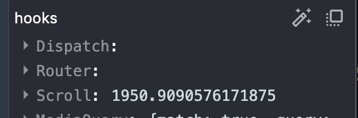

# useDebugView

### 정의

React DevTools 안에서 커스텀 훅에 라벨을 붙여주는 훅

### 사용 방법

```js
import { useDebugValue } from 'react';

useDebugValue(value, format?)
```

- 커스텀 훅 내부를 디버깅 할 때 사용한다.
- value는 DevTools에서 표시할 값을 의미하며, 어떤 타입이든 가능하다.
  - `useDebugValue(state)` useState의 state 값
  - `useDebugValue(props)` 컴포넌트의 props 값
  - `useDebugValue('helloWorld')` 문자열
  - `useDebugValue({name: 'helloWorld'})` 객체
  - `useDebugValue([1, 2, 3])` 배열
- format은 옵셔널 함수다. format 함수를 지정하게 되면 DevTools이 실행될 때에만 useDebugValue 훅이 동작한다.
  - format 함수는 useDebugValue 훅의 첫번째 인자인 value를 인자로 받아 그 리턴값을 DevTools에 표시한다.
  - 만약 format 함수를 지정하지 않는다면 첫번째 인자가 표기된다.

### 실무 예제

```js
// useScroll.ts
import { useDebugValue, useEffect, useState } from 'react';

function useScroll() {
  const [scrollY, setScrollY] = useState<number>(0);

  useDebugValue(scrollY);

  ...}
```



- 훅이 실행될 때 마다 값이 바뀌는 것을 확인할 수 있다.

### 언제 사용해야 할까?

- 이름처럼 useDebugValue 훅은 복잡한 구조를 가진 '커스텀 훅'을 React DevTools과 함께 디버깅 할 때 사용한다.
- useDebugValue 훅을 코드에 넣은 채로 prd 환경에 배포하면 렌더링 될 때마다 동작한다. 이는 성능에 영향을 줄 수 있다.
  - 성능 상의 이슈를 해결하기 위해 format 함수가 존재한다. format 함수를 넣어주면 해당 훅을 React DevTools를 실행할 때만 동작하도록 만들 수 있다.
  - 그러나 공식 문서에서도 언급하듯 useDebugValue 훅은 디버깅 목적의 훅이기 때문에 간단한 로직이나 내부 상태를 가진 커스텀 훅에서는 사용이 권장되지 않는다. 여러 프로젝트에서 재사용되는 공통 라이브러리에 포함된 커스텀 훅이나, 복잡한 내부 구조를 가지고 있는 커스텀 훅의 내부 상태나 로직을 파악하기 위한 목적으로 만들어진 훅임을 유념하여 사용해야 한다.
