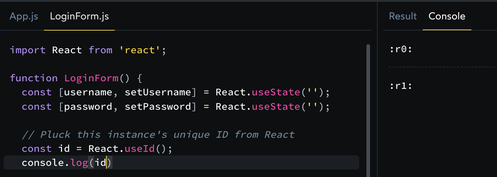

# useId

### 정의

접근할 수 있는 속성(attribute)에 전달할 수 있는 고유 ID를 생성하는 훅.

### 사용 방법

```js
import { useId } from 'react';

function PasswordField() {
  const passwordHintId = useId();
  // ...
```

- 컴포넌트의 최상위에서 useId를 호출하여 고유한 ID를 생성한다.
- useId는 매개변수를 받지 않는다.
- useId는 해당 컴포넌트 내에서 이 useId 호출과 연관된 고유한 ID 문자열을 반환한다
- hook이기 때문에 컴포넌트 최상위 레벨 또는 커스텀 훅에서만 호출이 가능하다.
- **리스트에서 key를 생성하기 위한 목적으로 useId를 사용하면 안된다.**

### 실무 예제

- 리액트 버전 18부터 사용이 가능합니다.. (눈물)
- 콘솔에 찍어보면 아래와 같이 나옵니다



### 언제 사용해야 할까?

- html 태그에서 서로 연관된 태그임을 명시하고자 할 때

```js
import { useId } from "react";

function PasswordField() {
  const passwordHintId = useId();
  return (
    <>
      <label>
        Password:
        <input type="password" aria-describedby={passwordHintId} />
      </label>
      <p id={passwordHintId}>
        The password should contain at least 18 characters
      </p>
    </>
  );
}
```

- Form에서 label 컴포넌트와 input 컴포넌트를 연결할 때

```js
import { useId } from "react";

function PasswordField() {
  const passwordHintId = useId();
  return (
    <>
      <label>
        Password:
        <input type="password" aria-describedby={passwordHintId} />
      </label>
      <p id={passwordHintId}>
        The password should contain at least 18 characters
      </p>
    </>
  );
}

export default function App() {
  return (
    <>
      <h2>Choose password</h2>
      <PasswordField />
      <h2>Confirm password</h2>
      <PasswordField />
    </>
  );
}
```
